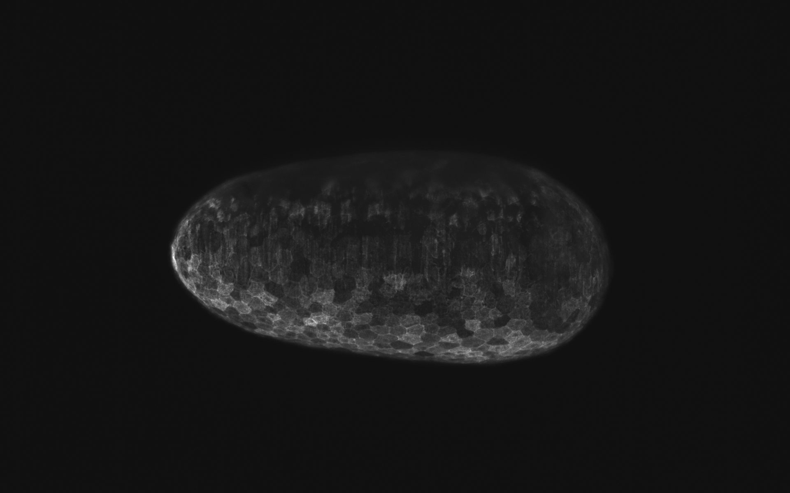
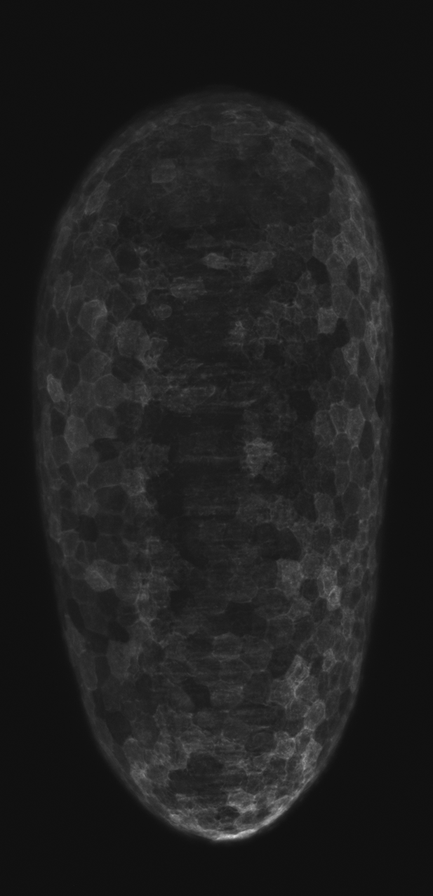

# Crop & Rotate Embryo TIF Images

A Python-based tool to process embryo time-lapse TIF images by cropping and rotating them according to configuration settings provided in a JSON file. This repository contains scripts that:
  
- Load TIF 2D images (8-bit or 16-bit) from specified directories. Expecting maximum intensity projections.
- Merge multiple illumination images if available.
- Apply thresholding, median filtering, and binary morphological operations (with optional GPU acceleration).
- Crop around the embryo based on edge detection and ellipse fitting.
- Rotate the cropped image based on the specified embryo head direction.
- Group image files into time series and process each timepoint sequentially or in parallel (multiprocessing/multithreading).
- Log processing details and optionally copy the script with a Git commit hash for reproducibility.

---

## Features

- **Flexible Configuration:** Provide a JSON file specifying input folders, specimen IDs, and embryo head directions.
- **Multiple Execution Modes:** Process timepoints sequentially, in parallel, or using multithreading.
- **GPU Acceleration:** Leverages [pyclesperanto](https://github.com/clEsperanto/pyclesperanto_prototype) for GPU-accelerated filtering and morphological operations if available.
- **Logging & Debugging:** Detailed logging and optional debug prints help trace and troubleshoot the processing steps.
- **Git Integration:** Optionally copies the running script with the current Git commit hash for version tracking.

<table>
  <tr>
    <td>
      <br>
      
    </td>
    <td>
      →
    </td>
    <td>
      
    </td>
  </tr>
</table>

---

## Prerequisites

- **Operating System:** Linux, macOS, or Windows.
- **Python:** Version 3.10 (recommended, higher versions untested).
- **Mamba/Conda:** For environment management.
- **Git:** Optional, for version tracking.

---

## Installation

We recommend using [mamba](https://github.com/mamba-org/mamba) (a fast, drop-in replacement for conda) to create a Python 3.10 environment and install the necessary dependencies.

1. **Install Mamba (if not already installed):**

   I am suggesting to follow installation instructions for `mamba` from https://github.com/conda-forge/miniforge.

2. **Use environment.yml to create ready environment**
   Then create the environment with `mamba`:

   ```bash
   mamba env create -f environment.yml
   mamba activate embryo_crop_env
   ```

2. **Alternatevely create a New Environment step by step:**

   ```bash
   mamba create -n embryo_crop_env python=3.10
   ```

    - **Activate the Environment:**

    ```bash
    mamba activate embryo_crop_env
    ```

    - **Install Required Dependencies:**


    You can install the required packages in existing environment. Below is a sample command; adjust as needed:

    ```bash
    mamba install -c conda-forge tifffile tqdm numpy scikit-image opencv scipy pyclesperanto gitpython
    ```

---

## Configuration

Create a JSON configuration file to specify the folders and settings for processing. An example configuration might look like:

```json
{
    "timeseries": [
        {
            "z_projections_folder": "/path/to/z_projections",
            "specimen_id": 3,
            "embryo_head_direction": "left"
        },
        {
            "z_projections_folder": "/path2/to/z_projections",
            "specimen_id": 11,
            "embryo_head_direction": "right"
        }
    ]
}
```

- **z_projections_folder:** Path to the folder containing TIF images.
- **specimen_id:** An integer identifier for the specimen to be processed.
- **embryo_head_direction:** Either `"left"` or `"right"`, indicating how the cropped image should be rotated.

Script was written for input images with the following filename structure: `timelapseID-20250124-114341_SPC-0001_TP-0000_ILL-0_CAM-1_CH-01_PL-0000-outOf-0090.tif`
---

## Usage

Run the script from the command line by specifying the path to your configuration file and an output directory:

```bash
python your_script.py /path/to/config.json /path/to/output_folder --log_level INFO --execution_mode multithreaded
```

### Command-Line Arguments

- **config_file:** Path to the JSON configuration file.
- **output_folder:** Directory where output images and log files will be saved.
- **--log_level:** (Optional) Set the logging level (e.g., DEBUG, INFO). Default is INFO.
- **--skip_patterns:** (Optional) A list of patterns. Time series keys containing any of these patterns will be skipped.
- **--execution_mode:** (Optional) Mode of processing timepoints:
  - `sequential`
  - `parallel`
  - `multithreaded` (default)
- **--no_gpu:** (Optional) Disable GPU processing.

---

## How It Works

1. **File Loading & Grouping:**  
   The script scans the provided `z_projections_folder` for TIF files, parses filenames for timepoint, illumination, and specimen information, and groups files into time series based on parsed metadata.

2. **Image Processing:**  
   For each time series, the first timepoint is processed to determine the crop shape. Subsequent timepoints are processed using the selected execution mode:
   - **Thresholding:** Median filtering (CPU/GPU) followed by triangle thresholding and binary opening.
   - **Cropping:** Detects the embryo region using Canny edge detection and ellipse fitting, then crops and rotates the image.
   - **Rotation:** Based on the embryo head direction (`left` or `right`), rotates the cropped image by 90 degrees.

3. **Output & Logging:**  
   Processed images are saved in the output directory, with detailed logging of each processing step. Optionally, the script copies itself to the output folder with a Git commit hash appended to the filename for version control.

---

## Contributing

Contributions are welcome! (This does not only come from LLM :) ) Please fork this repository and create a pull request with your improvements. For major changes, please open an issue first to discuss your proposed changes.

---

## License

This project is licensed under the MIT License. See the [LICENSE](LICENSE) file for details.

---

## Contact

For questions or suggestions, please open an issue or contact the repository maintainer.

---

Happy Processing!